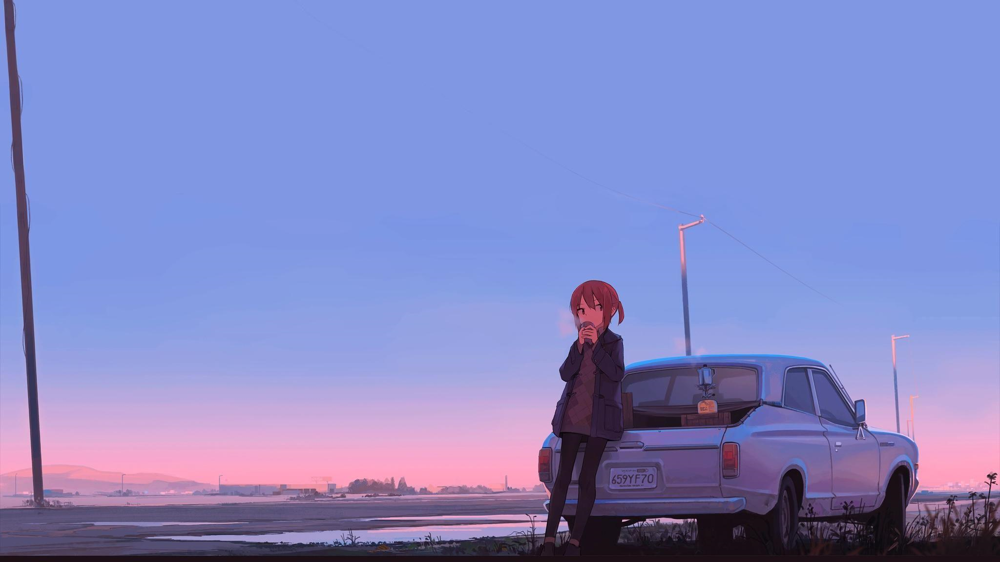

## Hello Wordl! I'm Ranzmvart 👋

<!--
**ranzmvart/ranzmvart** is a ✨ _special_ ✨ repository because its `README.md` (this file) appears on your GitHub profile.

Here are some ideas to get you started:

- 🔭 I’m currently working on ...
- 🌱 I’m currently learning ...
- 👯 I’m looking to collaborate on ...
- 🤔 I’m looking for help with ...
- 💬 Ask me about ...
- 📫 How to reach me: ...
- 😄 Pronouns: ...
- ⚡ Fun fact: ...     
  
-->- ⚡ I'm an Electrical Engineering Student ⚡
- 🌱 I’m currently learning **IOT (INTERNET OF THINGS)**                             
- 👾about me :**idk** 

  
  

###

### Skills

  
  
  
  
  
  
  

  

### Acces to me

### Snake px

 

